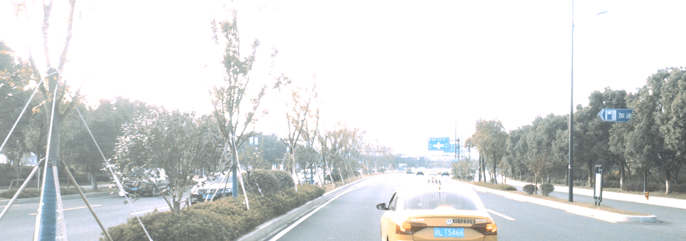
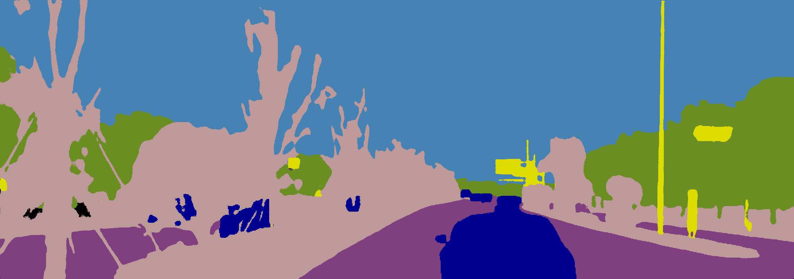

# ERFNet based Semantic Segmentation

## Introduction
Our radar depth completion algorithm needs image segmentation labels. 
This work is a semantic segmentation migration learning based
on a small amount of labeled data.

```1. python data_pre.py``` 

```2. python cityscapesscripts/cityscapesscripts/preparation/createZhoushanTrainIdImgs.py```

```3. python cityscapesscripts/cityscapesscripts/preparation/createZhoushanColorImgs.py``` 

```4. sh auto_train.sh```
 
```5. sh auto_info.sh```

## Results
  

